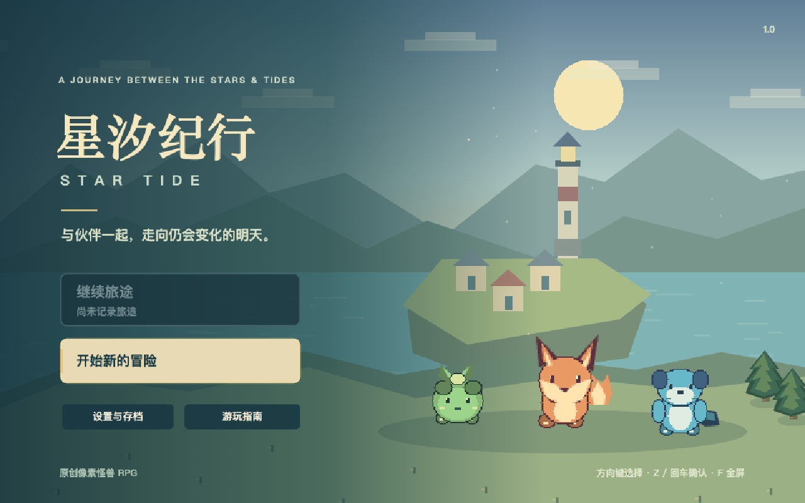
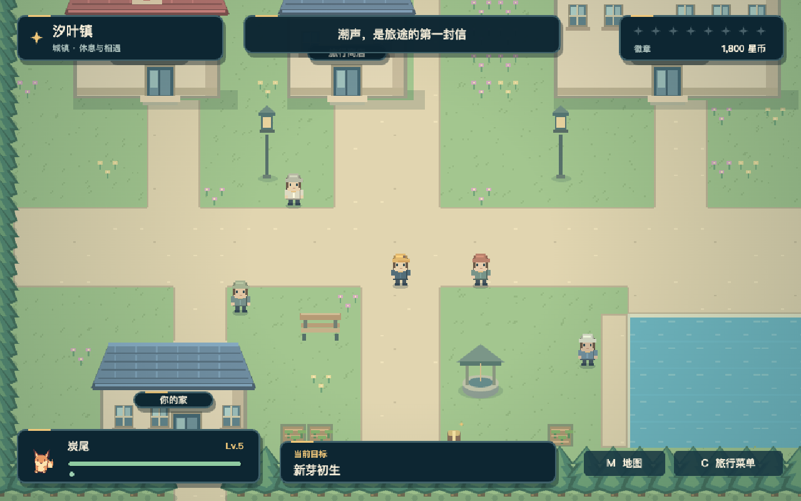
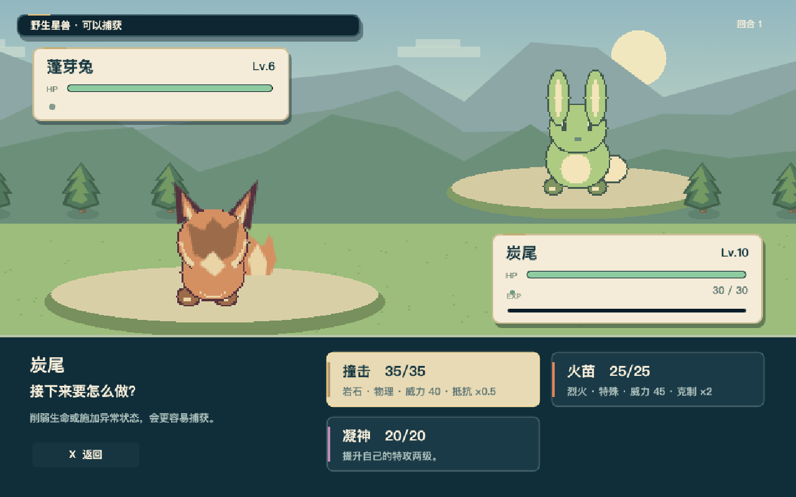

# 星汐纪行 · Star Tide

一个用 AI（Codex GPT-6 Astra Extra High）编写（单个提示词直出，用时大约1小时10分钟）的类宝可梦像素怪兽 RPG demo，以第四世代宝可梦游戏为参考。可以探索城镇、捕获伙伴、培养进化，挑战八座道馆和联盟，完成一段围绕星潮与蚀星会展开的冒险。

## 直接玩

1. 下载本目录的 **[index.html](index.html)**。在 GitHub 文件页使用下载原始文件的功能，或下载整个仓库。
2. 用桌面浏览器打开下载好的 HTML，选择「开始新的冒险」。

**不需要安装 Node.js、npm 或任何依赖，不需要启动服务，也不需要联网。** 游戏的代码、样式、像素画面和合成音乐全部在这一个 HTML 里。其余文件只用于展示。

仓库里的 HTML 文件预览显示的是源码；下载到本地后才是实际游玩界面。

## 游戏里有什么

- 57 种原创星兽、9 种属性，捕获、技能、升级、进化和六人队伍。
- 回合制对战，包含属性克制、物理与特殊技能、异常状态、换人和道具。
- 城镇与道路探索、八座道馆、蚀星会主线、冠军之路、四天王和冠军。
- 通关后的传说星兽探索、图鉴收集与再挑战。
- 全屏画面、像素场景、音乐、游戏内菜单和存档导入导出。

## 操作与存档

| 操作        | 按键             |
| ----------- | ---------------- |
| 移动 / 选择 | 方向键或 WASD    |
| 确认 / 交互 | Z、回车或空格    |
| 返回        | X / Escape       |
| 菜单        | C                |
| 地图 / 日志 | M / J            |
| 快跑        | 移动时按住 Shift |
| 全屏        | F                |
| 翻页        | Q / E            |

也支持鼠标点击寻路和交互。声音、对战速度与触屏按键可以在游戏设置中调整。

自动存档保存在当前浏览器中。直接打开本地 HTML 时，各浏览器对文件存储的处理不同；需要长期保留的进度，可以在 **设置 → 导出存档** 下载为 JSON，以后再导入。更换浏览器或移动 HTML 文件前，也可以这样带走进度。

## 删除游戏数据

在标题画面的「设置与存档」，或游戏内 **C → 设置** 中，点击 **删除存档 → 确认删除**。看到「游戏数据已清除」后，关闭游戏，再删除 HTML 文件即可。

这个按钮会删除当前浏览器中对应游戏的主存档、备份和设置；关闭或重新打开标题画面不会把它们写回来。游戏没有安装组件或后台服务。浏览器自行维护的历史记录等不由游戏控制；如果曾经导出 JSON 存档，那些文件需要自行删除。

## 给AI的提示词

你唯一的任务是，写一个完整，真正可玩，有趣耐玩，没有bug，质量达到可公开上架发售这样一个程度的网页游戏。但注意，这是给我个人玩的游戏。虽然我说要达到可公开上架发售的质量，但这不意味着我会真的把它拿去发售。我这里说的是游戏本身的质量要达到可公开发售这样一个程度，但我实际上并不会真的发售它，我单纯只是想让你写一款很高质量的游戏给我个人玩。

在当前games这个repo下写代码就好。用nodejs加上vite来写/来运行，只要达到可以用vite运行游戏服务并且能在浏览器里打开就好，完全不需要去考虑各种其他部署方式，因为这个游戏只给我个人玩，我自己运行服务，然后在浏览器里玩就好。注意，不要把这个游戏当作一个网页来开发，网页只是载体，游戏实际上的体感应该要像是桌面游戏那样。特别是，千万不要出现滚动条，打开多个网页，各种传统网页元素之类的。它是一个真正的游戏，就算是在网页中打开，也不能让我感觉这是一个网页，它要让我感觉这是一个有沉浸感的，类似桌面游戏的体验。

因为这是我私下个人玩的游戏，所以在开发过程中，你不需要去做任何和公开发售相关的事情。

我不会在游戏的具体设计细节，或者实际的开发过程上，对你进行任何的约束。游戏设计上，我只会给你大方向上的要求。所有各种游戏设计的细节，以及整个开发过程中的所有细节，你都需要自己决定。

你可以用你/Codex内置的浏览器去开发以及测试游戏。你可以用你认为合适的方式去开发游戏，去设计各种具体细节，去评估游戏难度，去测试，等等等等。我不关心你具体怎么开发这款游戏，我只要最后你给我的结果是一款完整的，真正可玩的，有趣耐玩，没有bug，质量达到可公开上架发售这样一个程度的网页游戏。

这台电脑上已经有nodejs了，你直接用就是了。所有你的各种诉求，比如跑某些命令，安装特定的程序库之类的，如果被sandbox拦截了的话，如果合理的话，你向我申请，我都会给你权限。

以下是大方向上我对游戏的要求，请你务必严格遵守以下所有要求：

大方向上，我要你做一款类似口袋妖怪/宝可梦珍珠/钻石/白金版本的游戏。我特别强调，我要你做的是类似第四代的这个版本的游戏体验。

我不是要你去完整复刻整个游戏，我要求的是，在整体的游戏体验，操作，核心玩法机制，游戏画风上，它必须类似于宝可梦第四代。

我要一个完整的游戏，有完整的主线游戏流程：回合式对战，抓怪，技能，属性克制，升级，进化，完整主线剧情，探索各个城市，挑战8座道馆，击败反派组织（对应宝可梦第四代的银河队），挑战联盟，冠军之路，等等等等。

具体有哪些“宝可梦”，都是什么设定，都有什么技能，进化链是什么样，等等等等，你来决定。不需要去过多参考原版的宝可梦，你自己设计就好。

我暂时不要求太多各种支线剧情。

就以上这些要求，所有具体的细节，你来决定，你觉得怎么设计合适，就怎么来。
